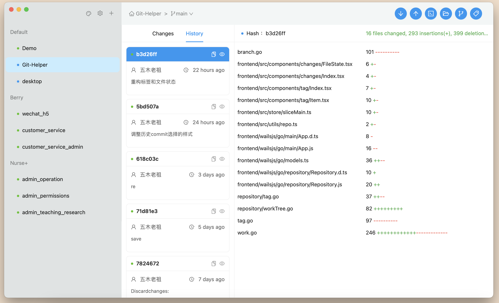
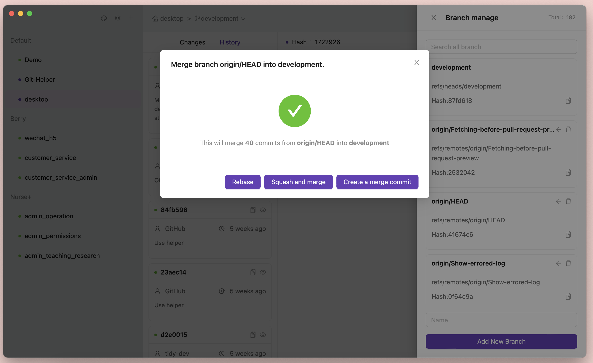
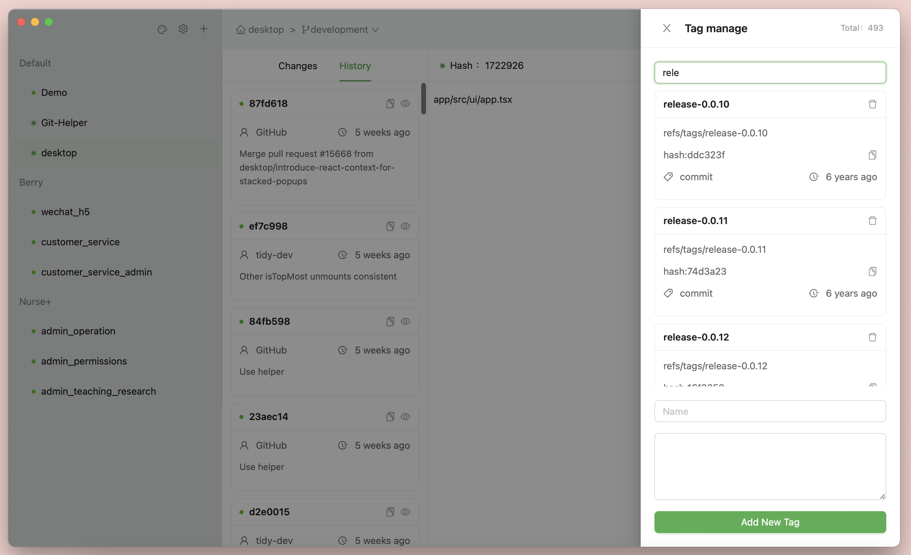

# Table of Contents
- [Introduction](#Introduction)
- [Features](#Features)
- [Installation](#Installation)
- [Usage](#Usage)
- [Screenshots](#Screenshots)
- [Contribution](#Contribution)
- [License](#License)

## Introduction
git-helper is an open-source software that aims to assist developers in using git more conveniently and efficiently. In some ways, it can also serve as a git GUI, allowing for quick management of multiple git repositories and grouping them for easy organization. When a specific repository is selected, the corresponding repository directory and command line can be quickly opened, and features such as branch and tag management, code committing and merging can be done.

## Features

- Friendly classification of git repositories
- Convenient code committing and merging
- Viewing commit history
- Branch management, including viewing, adding and deleting branches
- Tag management, including viewing, adding and deleting tags
- Switching between preferred color themes

## Installation

- Clone the source code and compile it.
- Download the binary file from the release page.

Note: Many features have only been tested on mac os, Although there are no destructive git commands, but this project is currently only provided for learning and research, please do not use it formally.

## Usage
Currently, there is no clone operation, so you can add your git repositories through the menu first. git-helper will record the repository's path and generate a repository alias, which will be placed in the default category. You can subsequently add categories to classify and sort these repositories. When you select a repository, any actions you perform will be executed in that repository's path. Therefore, when you delete the repository in git-helper, it only removes the path and does not make any destructive changes to your original repository.

## Screenshots

## Contribution
Feel free to open issues or pull requests if you have any suggestions or found any bugs.

## License
This project is licensed under the MIT License.